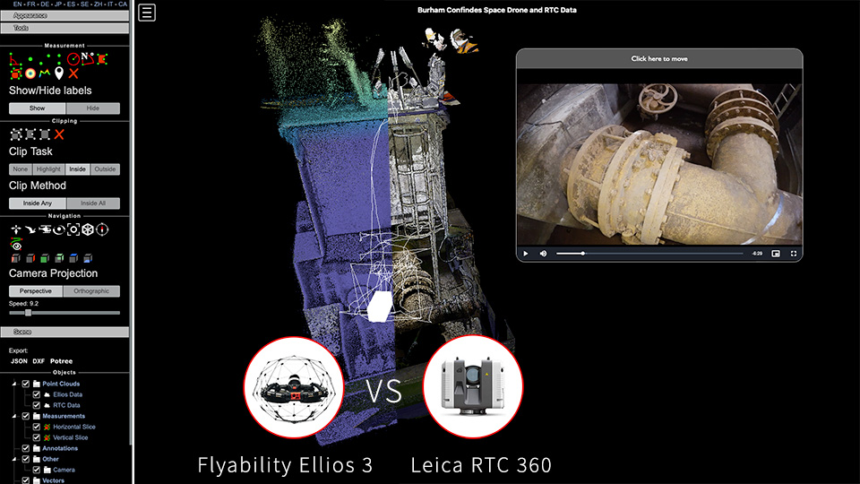

# Ellios 3 Drone Pointcloud Visualization



This repository provides a platform for visualizing point cloud data generated by the Ellios 3 drone, along with the corresponding video footage and live trajectory information. The Ellios 3 drone is known for its advanced LiDAR capabilities, making it a valuable tool for 3D mapping, surveying, and environmental monitoring.

## Table of Contents

- [Features](#features)
- [Demo](#demo)
- [Getting Started](#getting-started)
- [Usage](#usage)
- [Contributing](#contributing)
- [License](#license)

## Features

- **Point Cloud Visualization**: Display and explore 3D point cloud data captured by the Ellios 3 drone by using the Potree point cloud renderer.
- **Video Integration**: View synchronized video footage alongside the point cloud for enhanced analysis by using VideoJS and Potree.
- **Live Trajectory**: Track the live trajectory of the drone during data capture by using the Ellios 3 live telemetry logs.
- **User-Friendly Interface**: Intuitive web-based interface for easy navigation and interaction, based on the Potree point cloud viewer.
- **Customizable**: Adjust settings for point cloud rendering, video playback, and trajectory visualization.

## Demo

[Live Demo](https://www.site-portal.co.uk/project/652e8fba5985ecb8435304f8)

Check out the live demo to experience the Ellios 3 Drone Pointcloud Visualization in action. 
The data has been kindly provided by The Scan Station, a UK-based company that specializes in 3D laser scanning and drone surveying.

## Getting Started

To set up this project locally, follow these steps:

1. **Clone the repository**:

   ```bash
   git clone https://github.com/albert-fit/Ellios3-Point-Cloud-Viewer.git

2. **Go to the Potree repository on Github and download the latest release**:

   ```bash
   git clone https://github.com/potree/potree.git

3. **Build the Potree project and copy the build folder and the libs folder into the Ellios3-Point-Cloud-Viewer folder**:

   ```bash
   cd potree
   //where potree is the folder where you saved the Potree project
   npm install
   npm run build
   ```
4. **Create a folder called Data**
   ```bash
   cd Ellios3-Point-Cloud-Viewer
   mkdir Data
   ```
5. **Option 1 - Use your own data: Download the data from your Ellios3 drone and place it in the Data folder**  
   5.1 Use Inspector4 to download the data from your Ellios3 drone.  
     
   5.2 Use any video editing software (i.e. Adobe Priemier Pro, Final Cut Pro, etc.) to merge the .MOV files into one .mp4 video file/flight.  
     
   5.3 Use the PotreeConverter to convert the .las files into a tiled data set. Make sure you save the output of PotreeConverter in a separate folder. You can find more about it here:   
   https://github.com/potree/PotreeConverter.git  
     
   5.4 Use any plugin to convert the file that ends in flightTraj.csv into a .json or .js file. For this project, I wrote a tool in NodeJS that does exactly that and you can find it here:  
   https://github.com/albert-fit/Ellios3-liveTraj.csv-to-JSON.git  
     
   5.5 Take the compiled .mp4 video file, the folder with the tiled point cloud and the .json or .js file and place them in the Data folder.  
     

6. **Option 2 - Use the demo data: Download the demo data from the live demo and place it in the Data folder**
   You can download the data used for the live demo from here:  
   https://www.dropbox.com/sh/qosm46gvex71e0d/AADNPWG6vDcQMdvHOqbH5WIza?dl=0  
     
   Copy that data into the Data folder.  

7. **Run the project**
   If you use Visual Studio Code, you can use the live server utility on the HTML. Otherwise, you can use any other server to run the project.

   
## Usage

This example makes use of two point clouds: 
 - The Ellios 3 LiDAR point cloud data; and 
 - Leica RTC360 point cloud data.

The template used is the "multiple_pointclouds.html" template, which can be found in the Potree project.

## Contributing

# Contributions to this project are welcome! If you'd like to contribute, please follow these steps:

1.Fork the repository.
2.Create a new branch for your feature or bug fix.
3.Make your changes and ensure the code is properly documented.
4.Test your changes thoroughly.
5.Submit a pull request, describing the changes you've made.

## License

This project is licensed under the MIT License. See the LICENSE file for details.